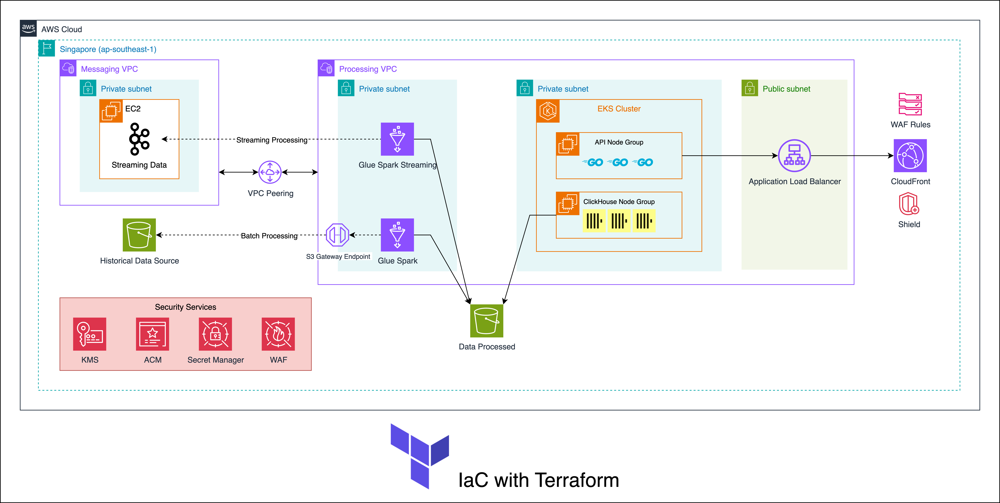

# Big Data Analytics Platform on EKS

This project implements a scalable big data analytics platform on AWS EKS with ClickHouse database for high-performance analytics and a Go API service for data access.

## Architecture



- **VPC Module**: Creates VPC, subnets, NAT gateways, and routing
- **EKS Module**: Creates EKS cluster with managed node groups
- **ECR Module**: Creates container registry for API images
- **ClickHouse**: Analytics database for transaction data
- **Go API**: REST API service for querying ClickHouse
- **ALB Ingress**: Load balancers for external access

## Prerequisites

- AWS CLI configured with appropriate permissions
- Terraform v1.0.0+
- kubectl v1.20.0+
- Docker installed and configured
- Go v1.18+ (for local development)

## Setup Instructions

### 1. Infrastructure Setup
```bash
# Clone the repository
git clone https://github.com/yourusername/challenge10-bigdata.git
cd challenge10-bigdata

# Copy and configure variables
cp terraform.tfvars.example terraform.tfvars
# Edit terraform.tfvars with your values

# Deploy infrastructure
terraform init
terraform plan
terraform apply
```

### 2. Deploy ClickHouse
```bash
# Configure S3 access for ClickHouse
./scripts/configure-s3-access.sh

# Deploy ClickHouse cluster
./scripts/deploy-clickhouse.sh
```

### 3. Load Transaction Data
```bash
# Load 2.35M transaction records from S3
./scripts/load-correct-data.sh

# Test loaded data
./scripts/test-final-data.sh
```

### 4. Deploy API Service
```bash
# Build and push API image to ECR
./scripts/build-and-push-api.sh

# Deploy API service
./scripts/deploy-api.sh
```

## API Endpoints

### Health Check
```bash
curl http://k8s-default-apiingre-e27345915c-655395237.ap-southeast-1.elb.amazonaws.com/health
```

### Query ClickHouse
```bash
curl -X POST http://k8s-default-apiingre-e27345915c-655395237.ap-southeast-1.elb.amazonaws.com/query \
  -H "Content-Type: application/json" \
  -d '{"query": "SELECT COUNT(*) FROM transactions.daily_transactions"}'
```

### Analytics Examples
```bash
# Top transaction categories
curl -X POST http://k8s-default-apiingre-e27345915c-655395237.ap-southeast-1.elb.amazonaws.com/query \
  -H "Content-Type: application/json" \
  -d '{"query": "SELECT category, COUNT(*) as count FROM transactions.daily_transactions GROUP BY category ORDER BY count DESC LIMIT 5"}'

# Daily transaction volume
curl -X POST http://k8s-default-apiingre-e27345915c-655395237.ap-southeast-1.elb.amazonaws.com/query \
  -H "Content-Type: application/json" \
  -d '{"query": "SELECT transaction_date, COUNT(*) as count FROM transactions.daily_transactions GROUP BY transaction_date ORDER BY transaction_date"}'
```

## Data Summary

- **Total Records**: 2,350,000 transactions
- **Date Range**: May 20-30, 2025
- **Amount Range**: 10,010 - 9,999,996 VND
- **Top Categories**: Utilities, Food, Transport, Entertainment, Shopping
- **Top Merchants**: Shopee, Grab, VNPay, Tiki, ZaloPay

## Project Structure

```
├── api/                  # Go API service code
│   ├── cmd/              # Application entrypoints
│   ├── internal/         # Internal packages
│   └── Dockerfile        # Container build definition
├── terraform/            # Infrastructure as code
│   ├── modules/          # Reusable Terraform modules
│   │   ├── eks/          # EKS cluster configuration
│   │   ├── ecr/          # ECR repository setup
│   │   └── vpc/          # Network infrastructure
│   └── main.tf           # Main Terraform configuration
├── kubernetes/           # Kubernetes manifests
│   ├── clickhouse/       # ClickHouse deployment
│   └── api/              # API service deployment
└── scripts/              # Utility scripts
```

## Clean Up

```bash
# Clean up applications
./scripts/cleanup-api.sh
./scripts/cleanup-clickhouse.sh
./scripts/cleanup.sh

# Destroy infrastructure
terraform destroy
```

## Contributing

Contributions are welcome! Please feel free to submit a Pull Request.

## License

This project is licensed under the MIT License - see the [LICENSE](LICENSE) file for details.